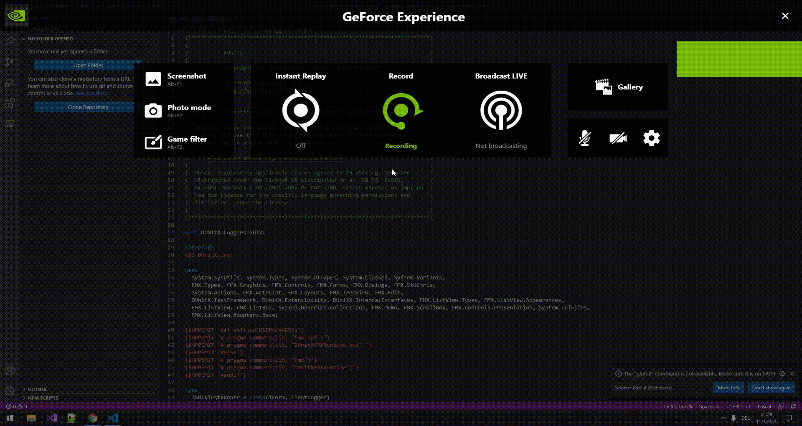

# delphi-uses-formatter

Formats uses sections of pascal files

Formatting follows this style:

```
uses
  AllUnitsAreAlphabeticallySorted,
  UnitA,
  UnitB,
  UnitC;
```

The extension gets activated on pascal and objectpascal languages or on first command use.

Command: pascal-uses-formatter.formatUses

## Settings

* pascal-uses-formatter.**formatOnSave**: when the extension is activated it also auto formats on save.

* pascal-uses-formatter.**formattingStyle**: Select formatting style.

(Default) Comma at the end:
```
uses
  UnitA,
  UnitB,
  UnitC;
```

Comma at the beginning:
```
uses
    UnitA
  , UnitB
  , UnitC
  ;
  ```

* pascal-uses-formatter.**overrideSortingOrder**: add specific units to order them at the beginning of uses sections.



[](https://dev.azure.com/tuncbahcecioglu/delphi-uses-formatter-CI/_build/latest?definitionId=1&branchName=master)
